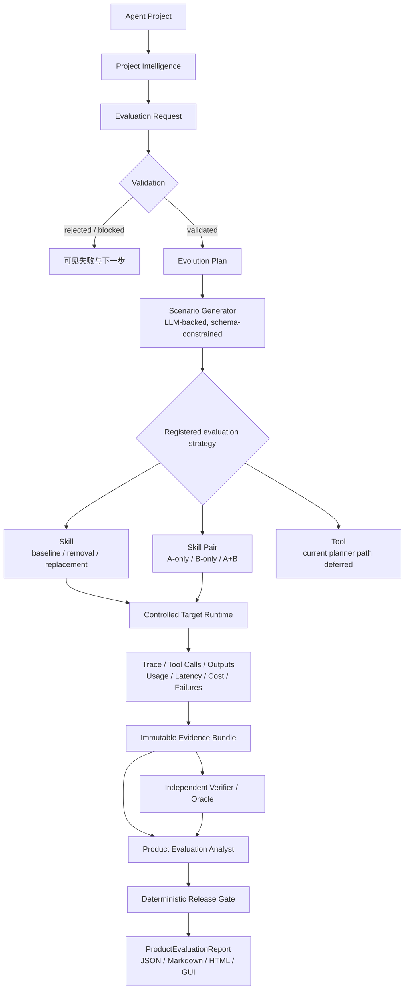
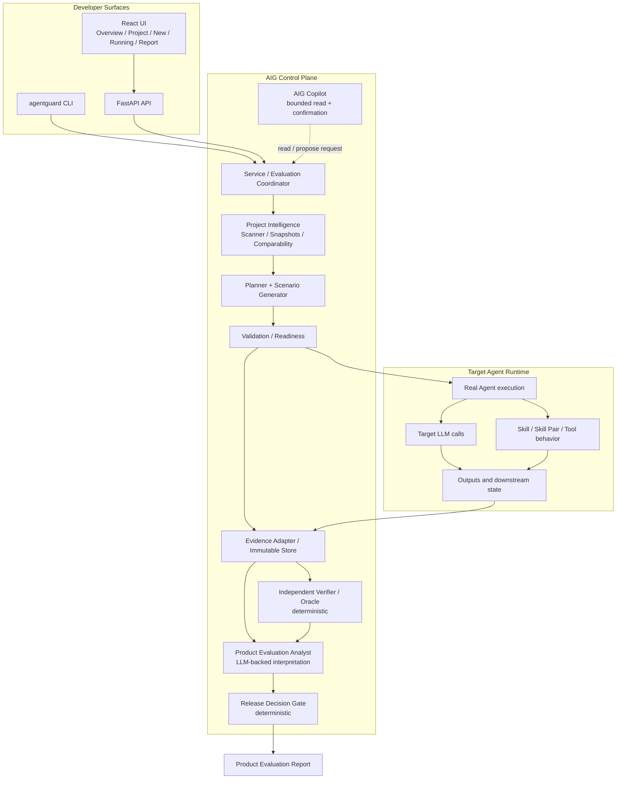

# 🛡️ Agent Iteration Guard

面向 Tool / Skill 型 Agent 的能力演进评估系统：用真实运行、不可变证据和确定性门禁回答一次 Agent 变更是否真的值得发布。

[🚀 Open Agent Iteration Guard](<AIG_DEMO_URL>?demo=lighttable) · [🧭 How AIG Works](#how-aig-works) · [🚀 Quick Start](#quick-start) · [⚙️ Public deployment](docs/demo-deployment.md) · [📊 Single Skill Report](examples/lighttable-evaluation-report.html) · [📊 Skill Pair Report](examples/lighttable-skill-pair-evaluation.html)

> **Live Demo**：当前仓库没有可确认的公网部署 URL，因此保留显式占位符，不编造地址。完成部署后，将 `<AIG_DEMO_URL>` 替换为 GUI 地址；`?demo=lighttable` 会让访问者直接进入只读 LightTable 示例。

> You changed a Skill, Tool, or interaction inside an Agent.  Did the Agent actually get better — or did you introduce a regression, conflict, or uncertainty?

**Agent Iteration Guard is an Agent Capability Evolution Evaluation system that turns real Agent executions into evidence-backed release decisions.**

它评估的是 **change**，而不是把 Agent 当成一个静态 benchmark snapshot。

## Why AIG

普通评测常常只给出：

```text
score: 82 → 86
```

但 Agent 开发者真正需要知道的是：

- 哪类用户场景改善了，哪类场景发生 regression；
- Skill 是否被正确触发、执行和交付；
- 两个 Skill 是协同、重复激活，还是互相干扰；
- Tool 是否调用成功、参数是否正确、下游任务是否完成；
- Provider / Runner / Environment failure 是否被错误算成 Agent failure；
- 证据是否足够支持 release，结论能否回溯到具体 scenario、trial、trace 和 oracle。

> **AIG evaluates the change, not just the Agent.**

## Product Tour

当前 UI 可以加载 LightTable 只读示例，浏览 Project Intelligence、变更、评估进度、Evidence、Product Evaluation Report 和 Release Gate。示例模式读取仓库中的已生成报告，不会启动新的目标 Agent，也不会允许编辑或重跑。

未来的完整 workflow GIF 预留在以下位置；当前只保留注释，不产生 broken image：

<!-- TODO: Add docs/assets/aig-overview.gif after capturing a verified end-to-end workflow. -->
<!-- Suggested sequence: LightTable → New Evaluation → Scenario / Running → Report → Evidence → Release Decision -->

```text
docs/assets/
└── aig-overview.gif
```

## How AIG Works 🧭

一次评估从项目身份和变更开始，在真正执行后才产生可审计的结论。不同组件使用不同的实验策略，但共享同一条控制面和证据边界。



## Evidence-Driven Evaluation 🔍

AIG 不接受下面这条链路作为完整 release evidence：

```text
Agent Output → LLM Judge → Score
```

正式评估保存实际执行中的关键事实，包括 scenario identity、condition / repetition、baseline / candidate identity、target trace、tool calls 与 arguments、observations、outputs / artifact hash、model request metadata、usage、latency、cost、failure classification、verifier / oracle result，以及 evidence manifest hash。

三层职责保持分离：

| 层 | 负责什么 | 不负责什么 |
| --- | --- | --- |
| Verifier / Oracle | 建立可复算的事实、状态和断言 | 不用 LLM 文本替代 Ground Truth |
| Product Evaluation Analyst | 解释已验证证据，形成产品语言和限制 | 不修改 trace、metric、verdict 或 evidence refs |
| Release Gate | 按固定规则检查完整性、矩阵覆盖、失败和语义审查状态 | 不调用 LLM，不投票改写 Analyst 或 Verifier |

> **LLMs may generate scenarios and explain evidence. They do not get to rewrite the evidence.**

## Agent System Architecture 🧠



这里的 Target Agent Runtime 是被评估对象：它执行真实 LLM call、Skill、Tool、workflow 和 output generation。AIG Control Plane 负责理解项目、规划实验、协调运行、收集证据、验证、分析和发布决策；它不会通过预编排脚本伪造目标 Agent 行为。

当前代码使用显式 Python Service / Coordinator 组织这条链路；仓库虽声明了 `langgraph` 依赖，但没有以 LangGraph `StateGraph`、node 或 edge 作为当前核心运行图。

## Evaluation Modes 🧪

| 模式 | 当前状态 | 核心对照 | 主要输出 | 边界 |
| --- | --- | --- | --- | --- |
| Skill Evaluation | ✅ 当前主路径 | baseline / removal / replacement | Trigger、Execution、Delivery、Boundary、scenario stability | 需要真实 target runtime 和独立 verifier |
| Skill Pair / Interaction | ✅ 当前主路径 | 同一 scenario / repetition 下 A-only、B-only、A+B | contribution、coordination、synergy、conflict、routing、reliability / cost | 只注册 Skill Pair；不扩展为任意多组件归因 |
| Tool Regression | ⚠️ deferred end-to-end | baseline Tool / candidate Tool | call success、argument correctness、downstream success、latency、cost | 目前有 artifact contract / adapter / `report tool` 边界，但没有通用 Planner / Runner / Oracle 闭环；GUI 不会创建虚假 Tool 请求 |

### Skill Evaluation

核心问题是：

> What changed when a capability was added, removed, modified, or replaced?

当前 Planner / Scenario Generator 覆盖 normal、constraint conflict、boundary、robustness 等场景类别，并冻结 scenario、证据要求、重复次数和运行预算。每个条件保留 `passed`、`failed` 或 `unresolved`；只有可比较的 matched cells 才参与差异与稳定性分析。

### Skill Pair / Interaction Evaluation

核心问题是：

> Do two capabilities create real collaborative value, or do they interfere with each other?

最小实验矩阵是：

```text
A only
B only
A + B
```

三条条件针对同一个 scenario 和 repetition 进行 matched comparison。当前聚合层提供 `ΔA|B`、`ΔB|A`、`Pair Gain`，并比较 A+B 相对最佳单 Skill 的 `better / equal / worse`。贡献指标只使用三臂都已解析的 matched triples；unresolved 会单独显示为 coverage，而不是被当成失败或成功吞掉。

关系感知的场景策略包括 `complementary`、`synergy`、`conflict`、`single_skill_dominant` 和 `boundary`，并可对重叠能力分析 routing。A+B 成功不自动等于 synergy：顺序执行、输出拼接或单纯多调用只能说明 observed behavior，不能直接升级为协同结论。

### Tool Regression

Tool 评估必须区分：

```text
tool call success
≠ argument correctness
≠ downstream task success
```

当前 Tool artifact validator 要求 baseline / candidate 两侧的调用、参数、下游结果、latency、cost、trace、output 和独立 oracle evidence。它是未来 Tool Runner 的证据边界，不代表 AIG v1 已经具备通用 Tool evaluation framework。

## Project Intelligence 🗂️

Project Intelligence 是 AIG 对被评估项目的结构化 Context Layer，不是 Agent Memory。当前扫描器可从本地 repository、package archive 或 Docker source 中建立项目快照；缺少语义声明时返回 `unresolved`，不会把任意源码猜成能力。

| 对象 | 作用 |
| --- | --- |
| Agent Manifest | 项目身份、用途、来源和能力表面 |
| Capability Registry | 可评估的 Skill、Skill Pair、Tool 及其责任、依赖和边界 |
| Runtime Profile | entrypoint、runtime、依赖、model 配置、fixture、trace / reset 合同和运行限制 |
| Baseline Snapshot | 不可变 baseline、fingerprint、能力快照和后续版本比较依据 |

它服务于：

```text
identity · evaluation scope · version comparison · reproducibility · evidence provenance
```

它不会进入目标 Agent 的长期用户 memory loop，也不负责用户记忆检索、写入或个性化对话。

## Controlled Experiments ⚖️

AIG 把公平比较和失败可见性放在运行层，而不是事后让 Analyst 猜：

- immutable baseline / candidate identity；
- same scenario、explicit condition 和 repetition；
- reviewed runtime、provider、fixture、reset、budget、timeout 和副作用边界；
- 每个 trial 的 trace、输出、工具观察、终止原因和 evidence refs；
- baseline / candidate 的可比性与 scenario readiness 在运行前检查。

基础设施问题不会静默变成 Agent regression。当前失败分类包括：

```text
target_behavior_failure
oracle_failure
provider_failure
runner_failure
environment_failure
budget_or_timeout
evidence_incomplete
```

## From Evidence to Release Decision 🚦

最终交付不是一个漂亮的平均分，而是 `ProductEvaluationReport` 加上独立的确定性 Gate。当前 Gate 决策名称以代码为准：

| Gate decision | 含义 |
| --- | --- |
| `approve` | 报告、证据完整性、hash、oracle、矩阵和语义审查均满足规则 |
| `review` | 证据可能完整，但存在产品风险、语义维度未支持或需要人工审查 |
| `block` | 报告未完成、证据缺失/冲突、矩阵不完整、运行失败或完整性校验失败 |

`unresolved` 仍保留在 scenario、condition、Oracle、Analyst 和 evidence status 中；它不会被强行改写成 pass / fail。Gate 只读取结构化事实和报告语义，不拥有 Analyst 的写权限。

## Example: Evaluating LightTable 💡

LightTable 是 demonstration project，不是 AIG 的领域依赖。一个完整的评估工作流可以概括为：

```text
1. Load LightTable
2. Select a Skill or Skill Pair
3. Create Evaluation Request
4. Generate and freeze scenarios
5. Run controlled trials
6. Verify evidence
7. Analyze product impact
8. Generate Product Evaluation Report + Release Decision
```

仓库中的两个 HTML 示例分别展示：

- **Single Skill**：`recipe_planning` 的 baseline / removal / replacement 对照，以及 Trigger、Execution、Delivery、Boundary 和稳定性叙事；
- **Skill Pair**：`recipe_planning + nutrition_check` 的 A-only / B-only / A+B 场景对照、Pair metrics、routing、interaction mechanism 和证据索引。

## AIG Copilot 🤖

Copilot 是受控的 application-layer sidecar，不拥有评估事实的写权限：

```text
Grounded Read → Action Plan → User Confirm → Execute existing Service write
```

- READ / ANALYZE 只读取当前项目、EvaluationRequest、Report 和 Evidence 的有限上下文；
- WRITE 目前只允许提出 `create_evaluation_request`，必须先显示冻结字段并获得确认；
- Confirm 后调用现有 `Service.create_evaluation_request` 和验证逻辑，只创建请求，不声称已经 Run 或生成报告；
- 不允许 Shell、任意代码、删除数据、修改 Evidence、覆盖 Verifier verdict 或改写 Release Decision；
- LLM 解释带有 interpretation notice，不能升级为确定性证据。

## Quick Start 🚀

### Prerequisites

- Docker Engine 与 Docker Compose v2；
- 只浏览 LightTable 不需要 Provider key；创建新评估、运行真实 Agent 或生成 Analyst Report 需要 Provider credential；
- 真实评估还需要被测 Agent 的可审查运行配置和独立 Oracle。

### Clone and start the read-only demo

```bash
git clone https://github.com/kkk17kkk/Agent-Iteration-Guard.git
cd Agent-Iteration-Guard
cp .env.example .env
docker compose -f docker-compose.yml -f docker-compose.demo.yml up --build -d
```

部署完成后访问 `http://<your-host>:8080/?demo=lighttable`。这个入口会直接加载 LightTable 的 Project Detail、Evaluation Plan、Evidence、Report 和 Release Decision；只读 Demo 不要求配置 Provider key，也不会接受写入请求。

### Configure providers for a real evaluation

复制 `.env.example` 后，只填写实际选择的 `DEEPSEEK_API_KEY`、`OPENAI_API_KEY` 或 `VLLM_API_KEY`，并按需设置模型与端口。secret 只通过容器运行环境读取，不进入 GUI、SQLite、Trace、报告或 Git。正式评估从 Overview 导入项目，建立 Project Intelligence，再进入 **New Evaluation → Configure Evaluation Model**。

### Run a writable private deployment

公开示例使用只读 Compose override；需要在受控网络中运行完整 GUI/API 时使用基础 Compose：

```bash
docker compose up --build -d
```

基础 Compose 通过同一个 HTTP 入口提供前端和 `/api/`，后端使用 SQLite 命名卷保存数据库、上传包和运行时缓存。它不提供用户认证或多租户隔离，不应直接暴露在没有访问控制的公网。

## Deployment ⚙️

AIG 保留完整的 Docker / local-first 部署，同时为 Public Demo 准备了 Vercel frontend + Railway restricted backend 的拆分方式。两者都复用当前 repository；Public Demo 只读，不开放真实 Provider、repo execution 或 evaluation execution。具体平台变量和验收项见 [Public Demo Deployment](docs/demo-deployment.md)。

### Docker / local-first

| 部分 | Docker 行为 |
| --- | --- |
| Frontend / API entry | Nginx 提供静态 GUI，并把 `/api/` 与 `/health` 反向代理到 backend；默认发布端口为 `8080`，可用 `AIG_HTTP_PORT` 覆盖 |
| Backend | Python 3.12 API 容器，监听容器内 `8000`，不直接发布到宿主机 |
| Demo assets | LightTable report JSON 与报告 logo 一起进入 backend image，Demo 不依赖调用方工作区 |
| Data | SQLite、上传包与 runtime source 使用 Docker named volume `agentguard-data` |
| Provider credentials | 通过 Compose 环境变量注入；Demo 模式不需要 key |
| Public demo | 使用 `docker-compose.demo.yml` 将所有非读请求返回 `403`，适合本地验收或受控接入 |

如果使用完整 Docker 版本，将域名或现有反向代理指向 Compose 发布的前端端口。Public Demo 的正式入口应使用 Vercel 生成的 HTTPS URL，并保留 `?demo=lighttable`；Railway backend 只提供预加载 LightTable canonical artifacts。

```bash
docker compose -f docker-compose.yml -f docker-compose.demo.yml up --build -d
```

仓库目前提供 Docker Compose、同源前端/API 代理、SQLite 持久卷、Vercel SPA 配置、Railway Docker 配置和公开 Demo 只读开关；认证、多租户、分布式调度以及支付、邮件、删除、部署等不可逆外部副作用仍不在 v1 范围内。

## Repository Structure 🏗️

```text
backend/
├── agentguard/
│   ├── api.py / cli.py / service.py              # FastAPI、CLI 和应用服务边界
│   ├── assets.py / project_upload.py              # 可移植资产与上传边界
│   ├── project_intelligence.py / project_scanner.py # 项目身份、快照、扫描
│   ├── evaluation_request.py / evaluation_dispatch.py # 统一请求与策略分发
│   ├── evaluation_planning.py / evaluation_scenario_generator.py # Plan 与场景
│   ├── evaluation_orchestration.py / target_runtime.py # 运行协调与目标接入
│   ├── interaction_runner.py / interaction_matrix.py # Pair 条件矩阵与 Oracle 边界
│   ├── evidence_bundle.py / change_adapters.py       # Level 1 不可变证据
│   ├── product_evaluation_analyst.py                # 证据约束下的产品解释
│   ├── product_evaluation_report.py / release_decision_gate.py # 报告与确定性 Gate
│   └── copilot.py                                   # 受控 Copilot sidecar
└── tests/                                           # 领域、API、适配器和失败路径测试
frontend/
├── src/main.jsx                                    # UI 状态、页面切换和 API 交接
├── src/pages/                                      # Overview / ProjectDetail / NewEvaluation / Running / Report
└── src/Copilot.jsx                                 # Copilot 面板
examples/
├── reports/                                        # LightTable 单 Skill / Skill Pair HTML 与 JSON/Markdown
├── provider-bindings/                              # 非 secret Provider binding 示例
└── oracles/                                        # 独立 Oracle 示例
docs/target-onboarding.zh-CN.md                     # target 接入说明
docker-compose.yml                                  # Docker 双容器部署配置
docker-compose.demo.yml                             # 公开只读 Demo override
frontend/nginx.conf                                 # 同源 GUI / API 入口
```

## Current Scope and Deferred Work

### 当前已支持

- 本地 repository / package / Docker source 扫描、Project Intelligence、immutable snapshot 和 runtime comparability；
- Skill Ablation 的真实 target runtime、scenario、trace、independent verifier、immutable evidence、Analyst 和统一报告；
- Skill Pair Interaction 的 A-only / B-only / A+B 计划、执行、matched aggregation、routing / failure 语义和报告路径；
- API、CLI、React UI 的 Project → Request → Plan → Readiness → Run → Evidence → Report → Gate 交接；
- JSON、Markdown、HTML 报告投影，以及 DeepSeek / OpenAI / vLLM 的 OpenAI-compatible Provider binding；
- 有边界的 AIG Copilot（读取、解释、确认后创建 EvaluationRequest）。

### 明确 deferred / 不宣称

- Tool Regression 的通用 Planner / Runner / independent Oracle end-to-end；当前只保留 artifact contract、validator、adapter 和受限 report boundary；
- Memory Evaluation、Prompt Evaluation、Benchmark Execution 和自动 multi-component attribution；外部 benchmark 只能作为 supplementary evidence 导入；
- 公网认证、多租户、分布式调度、生产写系统，以及支付、邮件、删除、部署等不可逆副作用；Public Demo 仅提供预加载 canonical artifacts 的只读部署；
- 任何未经当前真实 target run、独立验证和可复现证据支持的准确率、成本下降、性能提升或 benchmark 结论。

## Design Principles

- Real execution over synthetic scores
- Evidence before interpretation
- Deterministic facts, LLM explanation
- Evaluate changes, not isolated snapshots
- Fail closed when evidence is insufficient
- LightTable is a testcase, not the architecture
