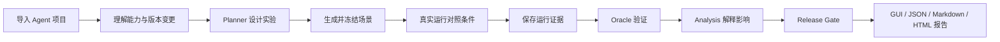
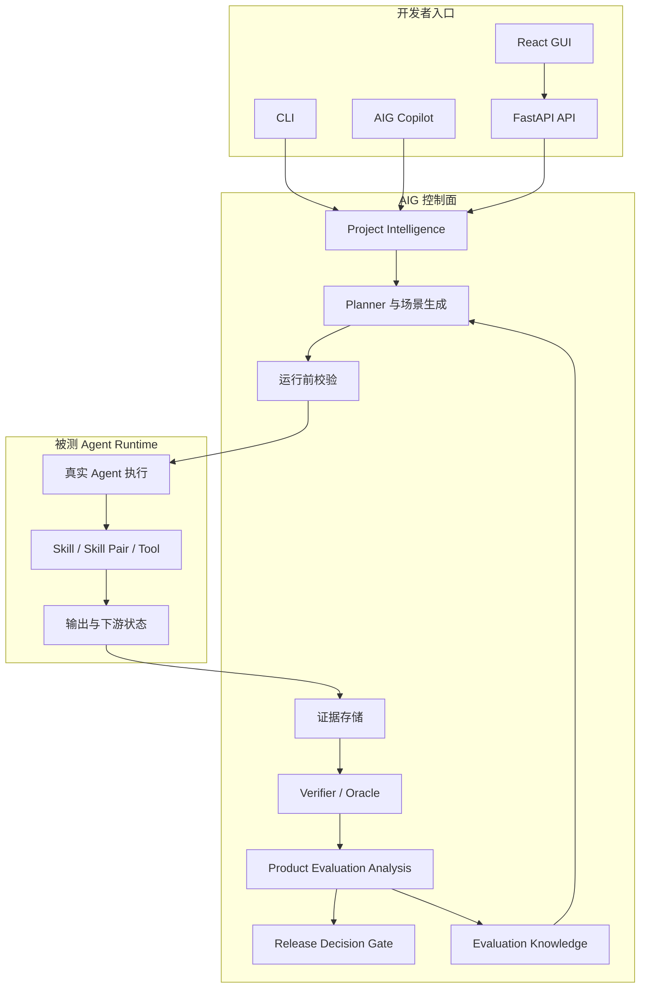

# 🛡️ Agent Iteration Guard

AIG 为 Tool / Skill 型 Agent 建立从变更理解、对照实验到发布决策的持续评估闭环，让每次能力迭代都能用真实运行结果回答：改善发生在哪里，代价是什么，现在能否发布。

[🚀 Open Agent Iteration Guard](https://agent-iteration-guard-demo.vercel.app/?demo=lighttable) · [📊 Single Skill Report Example](https://agent-iteration-guard-demo.vercel.app/api/v1/demo/reports/lighttable/export?format=html) · [📊 Skill Pair Report Example](https://agent-iteration-guard-demo.vercel.app/api/v1/demo/reports/lighttable/pair)

公开 Demo 已预加载 LightTable 评估结果，无需配置项目或 Provider 即可浏览完整报告。AIG Copilot 可辅助创建评估、理解项目上下文和分析实验结果，减少手工串联评估流程的工作量。

---

## ✨ Summary

| 重要部分 | 一句话说明 |
| --- | --- |
| 🧭 变更感知评估 | 以一次 Skill、Skill Pair 或 Tool 变更为起点，比较变更前后的能力、风险与运行代价。 |
| 🧪 实验 Planner | 根据项目能力、变更类型和历史结果生成场景与对照矩阵，并在运行前冻结假设、预算和验收条件。 |
| ⚖️ 匹配对照实验 | 在相同场景和重复轮次下运行各实验条件，只用可比较样本计算差异、稳定性与交互收益。 |
| 🔎 证据约束分析 | Oracle 先验证事实，Analysis 层再解释对产品行为的影响，结论可回到具体实验与运行证据。 |
| 🧠 版本评估记忆 | 从历史报告提取风险、有效维度和场景模板，为后续版本规划提供依据，同时保留证据来源。 |
| 🚦 发布决策 | 确定性 Gate 检查证据完整度、矩阵覆盖和风险状态，输出 `approve`、`review` 或 `block`。 |

---

## 🎯 Why AIG

固定 Benchmark 适合回答某个版本在一组固定任务上的表现。Agent 日常迭代还需要回答更具体的问题：哪项变更带来了提升，改善是否跨场景稳定，两个能力组合后是否产生冲突，以及收益是否值得额外的延迟与成本。

直接让另一个 Skill 评价被测 Skill，容易把评价者的提示词、偏好和输出文本当作结论。AIG 将评价过程拆成真实运行、独立验证、证据分析和发布门禁。LLM 可以设计候选场景和解释已验证结果，实验事实与最终门禁由结构化数据和确定性规则控制。

这套设计重点解决五类开发问题：

- 变更在哪些用户场景中改善、退化或仍无法判断；
- Skill 是否正确触发，并在过程、交付和边界行为上发挥作用；
- Skill Pair 的组合收益来自真实协作、路由选择，还是重复调用；
- Provider、Runner 和环境故障是否被正确区分，避免误报为 Agent 回归；
- 当前证据是否足以支持发布，以及结论如何复查和复算。

---

## 🧭 核心工作流



1. Project Intelligence 扫描本地仓库、压缩包或 Docker source，建立项目身份、能力清单、运行配置和版本快照。
2. Evaluation Planner 把变更翻译成实验假设、场景类型、对照条件、重复策略、预算和证据要求。
3. Runner 在同一批冻结场景上执行目标 Agent，记录结果、耗时、成本、工具行为和失败来源。
4. 独立 Oracle 判断可验证结果，Analysis 层将实验差异解释为触发、过程、交付、边界或交互影响。
5. Release Gate 读取报告与证据状态，给出可复查的发布建议。

评估失败会保留来源分类，包括目标行为、Oracle、Provider、Runner、环境、预算超限和证据缺失。无法确认的样本记为 `unresolved`，不并入成功或失败比例。

---

## 🧠 系统架构



控制面负责规划、协调、验证和报告，被测 Agent Runtime 保持为独立执行对象。项目中的 LLM 调用分为两类：目标 Agent 使用自己的 Provider 运行任务，AIG 控制面使用独立 Provider 生成场景或分析报告。两类配置、请求元数据和成本分别记录。

---

## 🧪 Evaluation Modes

当前完整主路径覆盖 Single Skill 与 Skill Pair。Planner 会按组件类型选择场景密度、实验条件和重复预算。

| 模式 | 场景设计 | 对照条件 | 默认实验规模 | 结果如何计算 | 当前状态 |
| --- | --- | --- | --- | --- | --- |
| Single Skill | 正常任务、约束冲突、能力边界、鲁棒性，每类 5 个场景 | baseline、removal、replacement | 20 个场景；每类抽 1 个场景重复 3 次，其余运行 1 次；最多 84 个 trial | 在三种条件均完成且 Oracle 已判定的 matched triples 上计算通过率和相对 baseline 的变化 | ✅ 完整主路径 |
| Skill Pair | Planner 先判断互补、竞争、检查器、重叠或不确定关系，再选择 3 至 4 类针对性场景，每类 8 个 | A only、B only、A+B | 24 至 32 个场景；每类抽 1 个场景重复 3 次；通常为 90 至 120 个 trial，硬上限 40 场景、144 trial | 在三臂均可比较的样本上计算 Pair Gain、条件贡献、优于或劣于最佳单 Skill 的比例，以及路由和成本变化 | ✅ 完整主路径 |
| Tool Regression | 比较调用、参数、下游结果、延迟与成本 | baseline Tool、candidate Tool | 由目标 Tool 合同定义 | 当前可校验和导入证据，通用 Planner、Runner 与 Oracle 尚未闭环 | ⚠️ 部分支持 |

表中的 rate 都是已执行样本上的观察比例，不代表模型给出的成功概率。Single Skill 只比较同场景、同轮次下齐备的三条件样本；Skill Pair 也要求 A only、B only、A+B 三臂齐备。未解析样本单独进入 coverage，使样本缺口在报告中保持可见。

### Single Skill

Single Skill 评估通过消融和替换回答能力贡献：

```text
原始能力 baseline
移除能力 removal
替换能力 replacement
```

Analysis 层从四个维度组织结果：是否正确触发、触发后的执行过程、最终交付质量、边界与约束行为。重复场景用于观察结果是否稳定，避免把单次成功直接解释为可靠提升。

### Skill Pair

Skill Pair 评估在同一任务上比较三臂结果：

```text
A only
B only
A + B
```

`Pair Gain` 表示组合条件相对最佳单 Skill 的观察收益。报告还会展示 A+B 更好、相同或更差的场景比例，并结合 Trace 判断路由是否合理、是否重复激活、是否出现冲突，也包括对相似的两个 skill 在不同场景下被测系统的选择偏好。只有正向 Pair Gain 与过程证据同时成立时，Analysis 才会给出有证据支持的协同结论。

---

## 🧩 Planner、Analysis 与评估记忆

### ① Planner：先定义怎样比较

Planner 读取项目职责、用户任务、能力边界、变更类型和历史评估知识，生成结构化 Evaluation Plan。计划包含实验假设、质量维度、场景、对照臂、成功条件、证据要求、重复次数、超时和总 trial 预算。场景生成完成后会绑定内容哈希与来源信息，后续执行不能静默改题。

Skill Pair 还会先形成关系假设，再决定应该重点测试互补、冲突、单能力主导、边界或重叠路由。关系假设只负责选题，不作为实验结论。

### ② Analysis：把证据翻译成产品影响

Oracle 先判断任务结果与状态断言，Product Evaluation Analysis 再解释哪些行为变化对用户有意义。每条结论必须引用已有证据，Analysis 无权修改原始运行结果、Oracle verdict 或确定性指标。最终报告同时保留主要发现、风险、限制、成本变化和建议动作。

### ③ Evaluation Knowledge：让后续迭代利用历史

每次完成的报告可以沉淀为版本评估知识，包括常见风险、有效评价维度、场景类型和原始评估引用。Planner 在同一项目的后续变更中检索这些记录，优先覆盖曾经暴露的问题。记忆条目保留证据等级与样本数，项目版本变化后可追踪失效状态，避免把旧结论直接套到新版本。

---

## 💡 Example: Evaluating LightTable

LightTable 用于展示 AIG 的完整流程，项目扫描、实验规划、运行证据、Analysis 和 Release Decision 都沿用通用接口。

```text
导入 LightTable
→ 选择 recipe_planning 或 recipe_planning + nutrition_check
→ 创建 Evaluation Request
→ 生成并冻结场景与实验矩阵
→ 运行 matched trials
→ Oracle 验证结果
→ 生成产品评估报告与发布决策
```

- [Single Skill Report Example](https://agent-iteration-guard-demo.vercel.app/api/v1/demo/reports/lighttable/export?format=html) 展示 `recipe_planning` 的 baseline、removal、replacement 对照，以及触发、执行、交付和边界分析。
- [Skill Pair Report Example](https://agent-iteration-guard-demo.vercel.app/api/v1/demo/reports/lighttable/pair) 展示 `recipe_planning + nutrition_check` 的三臂实验、Pair Gain、路由行为、交互机制和证据索引。

---

## 🚀 Quick Start

### 1. 启动只读 Demo

需要 Docker Engine 与 Docker Compose v2。

```bash
git clone https://github.com/kkk17kkk/Agent-Iteration-Guard.git
cd Agent-Iteration-Guard
cp .env.example .env
docker compose -f docker-compose.yml -f docker-compose.demo.yml up --build -d
```

浏览器访问 `http://localhost:8080/?demo=lighttable`。该模式直接加载 LightTable 报告，不需要 Provider key，也不接受写入请求。

### 2. 运行可写的本地版本

```bash
docker compose up --build -d
```

复制 `.env.example` 后，按实际选择配置 `DEEPSEEK_API_KEY`、`OPENAI_API_KEY` 或 `VLLM_API_KEY`。真实评估还需要被测 Agent 的可审查运行配置、reset 方式和独立 Oracle。完整接入说明见 [目标 Agent 接入文档](docs/target-onboarding.zh-CN.md)。

### 3. 使用 API 与 CLI

在 `backend/` 安装项目后，可直接使用 CLI：

```bash
cd backend
pip install -e .
agentguard --help
```

需要调试 API 时，可单独启动 FastAPI 开发服务并访问 `http://localhost:8000/docs`：

```bash
python -m uvicorn agentguard.api:app --reload --port 8000
```

评估结果可从 GUI 查看，也可导出为 JSON、Markdown 或 HTML。

---

## 🛠️ 技术栈

| 层级 | 当前实现 |
| --- | --- |
| 前端 | React、Vite、Nginx |
| 后端 | Python 3.12、FastAPI、Pydantic v2、SQLite |
| 运行与评估 | 显式 Service / Coordinator、目标 Runtime Adapter、独立 Oracle、确定性 Release Gate |
| Provider | DeepSeek、OpenAI、vLLM，统一使用 OpenAI-compatible binding |
| 交付与验证 | Docker Compose、pytest、Playwright |

---

## 📌 Current Scope

AIG v1 面向单仓库、可本地运行、具备 Tool / Skill 与可执行 Oracle 的 Agent。当前已打通 Single Skill、Skill Pair、GUI、API、CLI、评估记忆和多格式报告。Tool Regression 已具备证据合同与报告边界，通用端到端执行仍在完善。

公开 Demo 为只读部署。认证、多租户、分布式调度、生产系统写操作和自动发布不在当前范围内。
